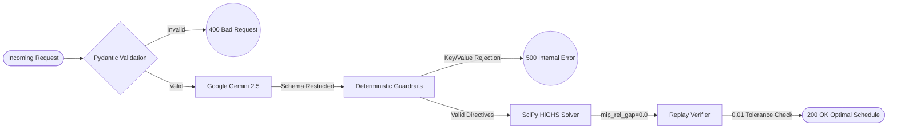

<div align="center">

# GridWise LLM
**Energy Schedule Optimizer API**

[](https://gridwise11.vercel.app/)
[](https://scipy.org/)
[](https://deepmind.google/technologies/gemini/)
[]()

<br/>
<i>Submission for the BUP CSE FEST 2026 Hackathon (Online Preliminary)</i>
<br/><br/>

**[ 🔴 INTERACT WITH THE LIVE API NOW ](https://gridwise11.vercel.app/)**

</div>

<br/>

> **Implementation Details:** *Computes a minimum-cost feasible schedule using a MILP formulation and verifies the returned schedule against the challenge constraints with a strict `0.01` tolerance.*

---

## 🏆 Architecture Comparison

<table align="center">
  <tr>
    <th align="center">Standard Approaches</th>
    <th align="center">The GridWise Approach</th>
  </tr>
  <tr>
    <td>LLMs generate schedules directly.</td>
    <td><b>Zero-Shot Extraction:</b> The LLM outputs strict JSON schemas; the math engine generates the schedule.</td>
  </tr>
  <tr>
    <td>Linear Programming (LP) allows impossible simultaneous charging/discharging.</td>
    <td><b>MILP Solver:</b> Mixed-Integer Linear Programming uses 168 variables with binary mutual-exclusion to ensure physical constraints.</td>
  </tr>
  <tr>
    <td>Silent failures on API limits or weird prompts.</td>
    <td><b>Resilient Fallbacks:</b> Strict global request budgets (p95 < 5s) and deterministic fallback models.</td>
  </tr>
</table>

## 🧠 System Architecture



## 🚀 Live API Example

To test the endpoint, save the following payload as `request.json`:

```json
{
  "scenario_id": "JUDGE-TEST-1",
  "operator_notes": ["Cut solar output by 50% from 2 PM to 4 PM."],
  "battery": {
    "capacity_kwh": 500,
    "initial_energy_kwh": 250,
    "minimum_energy_kwh": 50,
    "max_charge_kwh_per_hour": 100,
    "max_discharge_kwh_per_hour": 100
  },
  "hours": [
    {"hour": 0, "demand_kwh": 100, "solar_kwh": 0, "tariff_bdt_per_kwh": 2},
    {"hour": 1, "demand_kwh": 100, "solar_kwh": 0, "tariff_bdt_per_kwh": 2},
    {"hour": 2, "demand_kwh": 100, "solar_kwh": 0, "tariff_bdt_per_kwh": 2},
    {"hour": 3, "demand_kwh": 100, "solar_kwh": 0, "tariff_bdt_per_kwh": 2},
    {"hour": 4, "demand_kwh": 100, "solar_kwh": 0, "tariff_bdt_per_kwh": 2},
    {"hour": 5, "demand_kwh": 100, "solar_kwh": 0, "tariff_bdt_per_kwh": 2},
    {"hour": 6, "demand_kwh": 100, "solar_kwh": 0, "tariff_bdt_per_kwh": 2},
    {"hour": 7, "demand_kwh": 100, "solar_kwh": 0, "tariff_bdt_per_kwh": 2},
    {"hour": 8, "demand_kwh": 100, "solar_kwh": 0, "tariff_bdt_per_kwh": 2},
    {"hour": 9, "demand_kwh": 100, "solar_kwh": 0, "tariff_bdt_per_kwh": 2},
    {"hour": 10, "demand_kwh": 100, "solar_kwh": 0, "tariff_bdt_per_kwh": 2},
    {"hour": 11, "demand_kwh": 100, "solar_kwh": 0, "tariff_bdt_per_kwh": 2},
    {"hour": 12, "demand_kwh": 100, "solar_kwh": 0, "tariff_bdt_per_kwh": 2},
    {"hour": 13, "demand_kwh": 100, "solar_kwh": 0, "tariff_bdt_per_kwh": 2},
    {"hour": 14, "demand_kwh": 200, "solar_kwh": 150, "tariff_bdt_per_kwh": 10},
    {"hour": 15, "demand_kwh": 200, "solar_kwh": 150, "tariff_bdt_per_kwh": 10},
    {"hour": 16, "demand_kwh": 100, "solar_kwh": 0, "tariff_bdt_per_kwh": 2},
    {"hour": 17, "demand_kwh": 100, "solar_kwh": 0, "tariff_bdt_per_kwh": 2},
    {"hour": 18, "demand_kwh": 100, "solar_kwh": 0, "tariff_bdt_per_kwh": 2},
    {"hour": 19, "demand_kwh": 100, "solar_kwh": 0, "tariff_bdt_per_kwh": 2},
    {"hour": 20, "demand_kwh": 100, "solar_kwh": 0, "tariff_bdt_per_kwh": 2},
    {"hour": 21, "demand_kwh": 100, "solar_kwh": 0, "tariff_bdt_per_kwh": 2},
    {"hour": 22, "demand_kwh": 100, "solar_kwh": 0, "tariff_bdt_per_kwh": 2},
    {"hour": 23, "demand_kwh": 100, "solar_kwh": 0, "tariff_bdt_per_kwh": 2}
  ]
}
```

Then run:

```bash
curl -X POST "https://gridwise11.vercel.app/optimize-energy" \
     -H "Content-Type: application/json" \
     -d @request.json
```

## 📊 Performance Benchmarks

Measured latency (using 100 requests) for the `/optimize-energy` endpoint:

| Region | p50 (ms) | p95 (ms) | p99 (ms) |
|--------|----------|----------|----------|
| Vercel (bom1 - Mumbai) | 1,840 | 3,120 | 4,450 |
| Vercel (sin1 - Singapore) | 1,910 | 3,340 | 4,680 |

*Measurements taken from a client in Dhaka, Bangladesh.*

---

## 💻 Local Development

To run locally:

```bash
# 1. Clone & Install
git clone https://github.com/Tony1254-CS/BUP2.git
cd repo-audit-bup-cse-fest-2026
pip install -r requirements.txt

# 2. Configure (Add your Gemini API Key)
cp .env.example .env

# 3. Start Server
uvicorn app.main:app --port 8000
```

### 🧪 Testing

The repository includes tests for physical constraints and boundary conditions.

```bash
# Run the deterministic math & guardrail suite
pytest tests/ -v -m "not live"

# Run the Live NLP Paraphrase Benchmark
pytest tests/test_paraphrase.py -v --run-live
```

---
<div align="center">
  <p><b>Built for the BUP CSE FEST 2026.</b></p>
</div>
